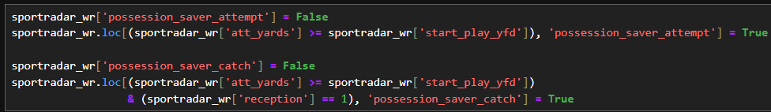
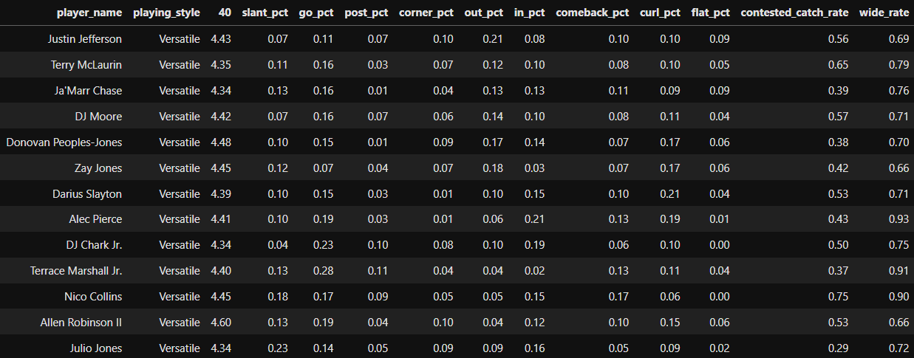

# Categorizing NFL Wide Receivers by Playing Style
 
*Justin Jefferson making a spectacular catch*

## Introduction
- The objective of this project is to build a K-Nearest Neighbors ("KNN") model that automatically classifies NFL wide receivers by playing style, using data on NFL wide receivers in the 2022 season.
- This model is a proof of concept for a tool that could be used to identify below-radar receivers who play in college or other professional leagues, such as the Canadian Football League and the United Football League.
  - NFL general managers and scouts are already aware of some players who have excelled at the high school and college levels, but they don't have the time to study every player.
  - When applied on receivers in college or other pro leagues, this tool streamlines the talent search process by identifying receivers who meet a team's playing style criteria.  

**What is K-Nearest Neighbors?** 
KNN is a model that assigns categories to data points based on the similarity of their features to other data points that are already categorized.

1. Let's say there's a dataset of restaurant goers with the following features as input:
    - Likes pork
    - Likes aromatics
    - Likes acidity
2. The category assigned to each restaurant goer as output is their cuisine preference.
3. You are a restaurant goer <u>without</u> a category assigned to you. You like pork, aromatics, and acidity in your food.
4. Four other restaurant goers also like all of those and have already been categorized with a cuisine preference. Their preferences are:
    - Vietnamese
    - Thai
    - Vietnamese
    - Vietnamese
5. We tell the model to look for the four most similar restaurant goers (data points) and assign a category.
    - The model sees that three of the four most similar data points have Vietnamese as their cuisine preference label. Your label will be Vietnamese.

         
        *Yum*

**Project Inspiration:** 
I love football. I love analyzing things. So I was inspired to reach out to Patrick Ward, Head of Research & Analytics for the Seattle Seahawks, to discuss the extent of his role with the team. As expected, he said his team uses models to more efficiently identify talent because they simply cannot watch game film on every player.

In a sports context, I've also only seen KNN models used to identify the positions of players. This is not a helpful application of KNN if you can simply look up a player's position.

So I set out to build a model that can be applied to college, CFL, and UFL data to find overlooked receivers.
 
*The Seahawks' war room during the 2024 draft. Head coach, Mike Macdonald, and general manager, John Schneider, have lots of talent to evaluate.*

**No Accuracy Metric:** 
- Since the model is meant to assign playing styles to receivers, there is no official accuracy metric because playing style is not an official designation. It varies by perspective.
- The quality of the model depends on the user's football acumen and how appropriate they feel the labels are.

## Sample Use Case
 
*Xavier Worthy is very, very fast*
1. The New England Patriots realize that their receivers group lacks a fast receiver who can "stretch the field vertically" - a receiver whose speed makes him a viable deep pass threat so defenders guard him closely, opening up the "underneath" (intermediate-distance) part of the field for other receivers.
2. The Patriots scouting team begins searching for a true speedster receiver who can run a 40-yard dash faster than 4.4 seconds, averages 5+ yards after catch, and can run a variety of routes.
3. The scouts, unable to watch game film on every prospect, ask the Patriots analytics team to feed college football data into this KNN model to narrow their search to college receivers who meet their criteria.
4. After using the model, they've found three candidates they could target in the later rounds of the upcoming NFL Draft, or perhaps pick up as undrafted free agents ("UDFAs").
    - These prospects are overlooked by most teams and don't get the attention of a prospect like Marvin Harrison, Jr.
5. The Patriots draft Blaze Johnson, a fast receiver from a Division III school, in the 6th round. Johnson ran a 4.32 40-yard dash at his Pro Day and often ran curl, comeback, flat, and out routes, which require sudden direction changes. He was not used only for vertical routes in college.
6. A preseason injury to the team's #3 receiver gives Johnson the chance to start every regular season game. Johnson records 623 yards and 5 receiving touchdowns as a rookie. His speed opens up more underneath passes for other receivers, giving Drake Maye more chances to gain confidence as a rookie quarterback.  

## Data Sources
**Sportradar ("SR")**:
1. Play-by-play data for the 2022 regular season was obtained from a Sportradar NFL API using a trial-access API key.
2. **Content:** After several rounds of unnesting, the dataset contains 154,285 rows and 217 columns. Types of data include week number, game clock, down, yards to gain, route type, quarterback, attempted air yards, and yards after contact.
3. **Cleaning:** New features were created to better capture differences in receiver playing styles. Irrelevant columns and rows were deleted.  

**Pro Football Focus ("PFF")**:
1. Player data for the 2022 regular season was obtained from my Pro Football Focus premium subscription. Since this dataset is from a paid membership, the CSV is not provided for download.
2. **Content:** Contains 507 rows and 45 columns. Half of the rows are for non-WR players who acted as receivers at least once during the season. The dataset includes contested catch rate, utilization rates at start of play (wide, slot, or inline), and yards per route run.
3. **Cleaning:** Player names had to be adjusted to enable a join with the Sportradar dataset.  

**NFL Combine and Pro Days**:
1. Player data the NFL Combine and multiple Pro Days for multiple years were scraped from https://nflcombineresults.com.
2. **Content:** Contains 1,875 rows and 13 columns for wide receivers.
3. **Cleaning:** Player names had to be adjusted to enable a join with the Sportradar dataset. Missing data for drills that players did not participate in were filled by using median values by weight class for each metric.
    - Justin Jefferson weighs 202 lbs, and did not partake in the bench press drill at the Combine.
    - The median number of bench press reps for his weight class (200 to 209 lbs) is 14.
    - Jefferson's imputed bench press reps figure is 14.  

## Exploratory Data Analysis ("EDA") of Sportradar Data
**Unnesting** 
The SR JSON data structure is very complicated and required some experimentation to understand what each layer contained. The layers are as follows:
- **Games** - Each row represents a game in the regular season
  - **Periods** - Each game row has 4 or 5 period rows. The 5th is for overtime.
    - **PBP (Play-by-play)** - Each period row has multiple PBP rows, each of which represents a single drive/possession or some other non-play related event, such as a TV timeout
      - **Events** - Each PBP row has multiple event rows, each of which represents actual plays.
        - **Statistics** - Each events row has multiple statistics rows, each of which represents a player's role in a play. Roles include passer, receiver, runner, defender (tackler, forcer of a turnover, or fumble recoverer), kicker, and punter.

**Filtering** 
I filtered the Sportradar dataset to only rows that recorded statistics for wide receivers. I also included certain QB-specific features from the passer rows.

 
*Figure : Narrowing down the data to WR-specific rows*

**New Features** 
I created new features that I think more granularly capture playing style, such as:
- Targets and catches by route
  - Some routes are more vertical. Others require more sudden direction changes.
- Targets and catches in play action
  - Play action fakes a run, drawing defenders closer to the line of scrimmage to free up defenders downfield. This makes it easier on receivers who have trouble creating separation from defenders on their own.
- Possession-saving attempts and catches
  - Big receivers who can win positioning fights with defenders to catch passes at the line to gain don't often make "explosive plays" (gains of 20+ yards), but they can make catches that sustain possessions. Smaller receivers cannot make such catches because they usually get outmuscled by defenders.

     
    *Figure : Creating attempt and catch columns for possesion-saver plays*

## Aggregation
I then aggregated the data by receiver for the 2022 season and joined it to the PFF and Combine data.

 
*Figure : Data aggregated by receiver*

I also created new features once the data were aggregated by receiver. This cell shows how I created utilization rates based on route type and play type as percentages of targets for the season.

 
*Figure : Utilization rates*

## Methodology
I evaluated two clustering models, K-Means Clustering and K-Nearest Neighbors.

**K-Means Clustering:** 
I originally intended to use K-Means because it's an unsupervised model and would create clusters of receivers based on the features it was fed. However, with every iteration, I would always see several strange clusterings of receivers with completely different physical attributes and playing styles. I then decided to nix this approach.

 

*Tyreek Hill and CeeDee Lamb should not be in the same category.*

**K-Nearest Neighbors:** 
I turned to KNN so I could train the model on a few receivers who are prototypes of certain playing styles. This was meant to point the model in the right direction when labeling unlabeled receivers.

**Wide Receiver Playing Styles:** 
- Versatile
    - A receiver who possesses good speed, route running skills, hands, ball tracking ability, mid-air body control, and catch radius.
    - <u>Examples:</u> Justin Jefferson, Ja'Marr Chase
- Speedster
    - Generally a smaller receiver who relies mainly on his speed to get open.
    - May also be a good route runner, but still relies more on speed.
    - May also have superb acceleration and deceleration.
    - <u>Examples:</u> Tyreek Hill, Brandin Cooks
- Big Speedster
    - A big, strong receiver who also has great speed.
    - Sometimes has good route running skills, but relies more on pure athleticism.
    - <u>Examples:</u> DK Metcalf, AJ Brown 
     
      *DK Metcalf ran a 4.33 40 at 228 lbs*
- Possession
    - A big, strong receiver who is usually targeted for short/intermediate yardage just past the line to gain, particularly on 3rd or 4th down to save the team's possession.
    - Targeted in possession-saving situations because they have the physicality to make highly contested catches, as the line to gain is usually tightly defended.
    - May have good speed, but typically is a better route runner than track star.
    - <u>Examples:</u> Mike Evans, DeAndre Hopkins
- Route Technician
    - An expert route runner with elite footwork, agility, and understanding of defensive movements.
    - Is great at getting defenders to commit to fakes.
    - May also have good speed.
    - Can be counted on for short, intermediate, and deep passes.
    - <u>Examples:</u> Stefon Diggs, Davante Adams 
     
      *Davante Adams is an elite route runner*
- YAC Specialist
    - Not a very refined route runner, but great at catching short passes and gaining more yards after the catch.
    - Has elite agility, acceleration, and deceleration to quickly change directions and weave through defenders.
    - <u>Example:</u> Deebo Samuel
- Slot
    - A smaller receiver who typically does not have good speed, but has good route running skills and can get open in crowded areas
    - Typically lines up in the slot (more inward, rather than near the sideline)
    - Can still sometimes free himself for deep passes
    - <u>Examples:</u> CeeDee Lamb, Cooper Kupp

**Principal Component Analysis ("PCA"):** 
In short, PCA is a way of narrowing the model's features to those that have the biggest effect on its output.

## Results
**Model Performance**: 
Since there is no accuracy metric, the model user must apply their football expertise to determine whether a player's label is reasonable.

**Key Findings**: 
1. In my opinion, the model does a great job overall of categorizing receivers by playing style.
2. For each category, there are a few puzzling inclusions.
3. Some of the most impressive labelings are:
    - Julio Jones as a "Versatile" receiver. Although Jones is big and fast, he has established himself as a receiver who "can do it all."
    - Michael Thomas as a "Possession" receiver. Thomas is big, but lacks speed. He's best known for short- and intermediate-yardage catches with defenders closely guarding him. His large frame and excellent hands made him a favorite target of Drew Brees.
    - Devin Duvernay as a "Speedster" receiver. Duvernay has mostly played as a kick/punt returner. Receivers with great speed and mediocre (or worse) route running are often asked to return kicks/punts. 

**Versatile**
- Looks good. Most of these guys are fast. Notable inclusions are:
- Julio Jones, despite being very big and fast, is a truly versatile receiver. I'm impressed that the model didn't classify him as "Big Speedster."
- Terry McLaurin, DJ Moore, and DJ Chark are great picks.
 
*Figure : Versatile receivers*
  

**Route Technician**
- Looks good for the most part. Some notable inclusions are:
- Amari Cooper - Highly praised for his crisp route running.
- DeSean Jackson - More of a speedster, and not a refined route runner. 42% of his routes are mostly vertical (go, corner, and post). 29% of his routes are curls. This does not make for a varied route tree.
 
*Figure : Route Technicians*
  

**Speedster**
- The expected traits are well-represented: sub-4.4 40, sub-200 weight, high ADOT, and high utilization in deep passes and vertical routes.
 
*Figure : Speedsters*
  

**Big Speedster**
- Looks fairly accurate, based on 40 time, bench press reps, average depth of target, average YAC, and percentage of vertical routes.
- Receivers with 40 times in the upper 4.5s should not be in this category.
 
*Figure : Big Speedsters*
  

**Possession**
- Looks good. Michael Pittman, Drake London, and Courtland Sutton are commonly thought of as possession receivers.
 
*Figure : Possession receivers*
  

**YAC Specialist**
- Not a lot of receivers, as expected. If you're not that great at running routes, but can still make big yardage gains once the ball is in your hands, you are usually asked to play running back.
- The model appears to be looking for very low ADOT (sometimes negative, meaning "behind the line of scrimmage"), high average YAC, and high utilization in screen plays.
 
*Figure : YAC Specialists*
  

**Slot**
- Chris Godwin, Cooker Kupp, Tyler Boyd, and Keenan Allen are here, as expected.
- The model seems to key off the high slot rate, high utilization in WR screens and direction-changing routes, lower ADOT, and higher YAC
 
*Figure : Slot receivers*
  

### Utilization metrics > success metrics
I created many new features that I thought would capture nuances of player style. I decided to drop the success-based and sum features, keeping the utilization rates because teams utilize receivers in ways they think play to the receivers' strengths:
- A big and slow receiver who is frequently targeted at the line to gain but has caught only 20% of these targets should still be considered a possession receiver.
  - The team believes this type of play is one of his strengths, and utilizes him in such a way.
- A fast receiver who has a deep pass utilization percentage of 80% and only 5 targets on the season should not be considered less of a speedster receiver than Tyreek Hill, who has been very statistically productive.

### Imputing missing values
- I used median by weight class to fill in missing values for the various for the Combine and Pro Days.
- In a future iteration, I may want to consider using K-Nearest Neighbors.

### Receivers with few targets
<u>Concern:</u> 
Some receivers had very few targets in the 2022 season, so their assigned playing styles may not be accurate. 

<u>Response:</u> 
- Receivers with few targets are still utilized in ways their teams think match their strengths. A big and fast receiver may be called in almost exclusively for deep passes on vertical routes.
- Since this model is intended to be applied to college football data, it will have more receivers with more playing time, making the labelings more likely to be accurate.

## Conclusion
The model rather accurately labeled receivers and, with some more tweaks, could serve as a proof of concept for something to be applied in talent searches.